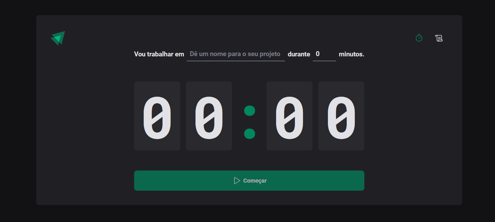

<h1 align="center">
    IGNITE TIMER
</h1>

<div align="center">
   <a href="#desktop_computer-project">
      
   </a>
   <a href="#nail_care-layout">
      
   </a>
   <a href="#technologist-technologies">
      
   </a>
   <a href="#clipboard-how-to-use">
      
   </a>
   <a href="#speech_balloon-contact">
      
   </a>
   <a href="https://ignite-timer-livid.vercel.app/">
      
   </a>
</div>
<br>

## :desktop_computer: Project

Project made through the Ignite course on the [Rocketseat](https://app.rocketseat.com.br/cart/rocketseat-one-black-month-lote-02?referral=joeyanovich&utm_source=platform&utm_medium=organic&utm_campaign=venda&utm_term=mgm&utm_content=indication-lp_one) platform.

In class, it was necessary to build a React project knowing the main fundamentals behind the tool.
<br>

Concepts that were learned:

- `vite`
- `react-components`
- `react-props`
- `react-hooks`
- `react-state`
- `react-effect`
- `react-hook-form`
- `contexts`
- `routes`
- `styled-components`
- `typescript`


## :nail_care: Layout

<br><br>

<div align=center>

</div>


## :technologist: Technologies

- [Vite](https://vitejs.dev/)
- [React](https://react.dev/)
- [Typescript](https://www.typescriptlang.org/)


## :clipboard: How to use

Below are the instructions to access the application:

1. Clone the repository: 
```bash 
https://github.com/joeyanovich/ignite-timer
```
2. Install all dependencies by using command:
```bash
npm install
```
3. Run the code:
```bash
npm run dev
```


## :speech_balloon: Contact

<br>
<div align="center">
   <a href="mailto:joedison.dias@gmail.com">
      
   </a>
   <a href="https://www.linkedin.com/in/joedisondias/" target="_blank">
      
   </a>
</div>
